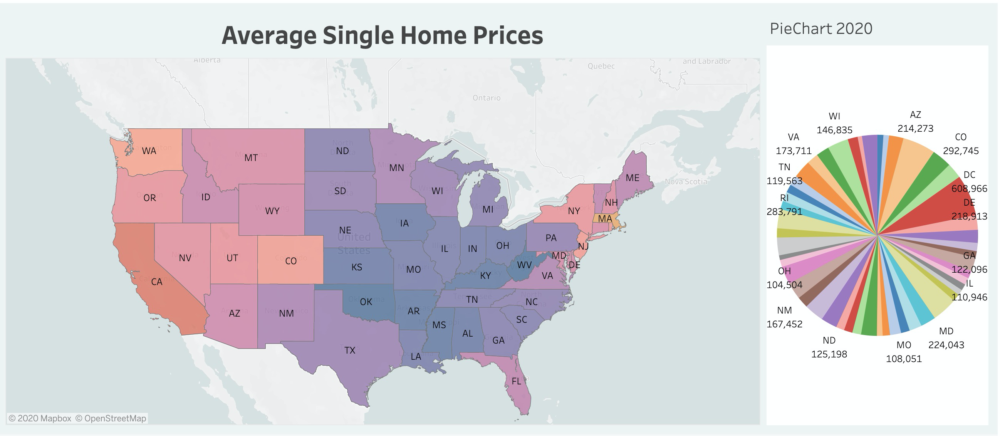
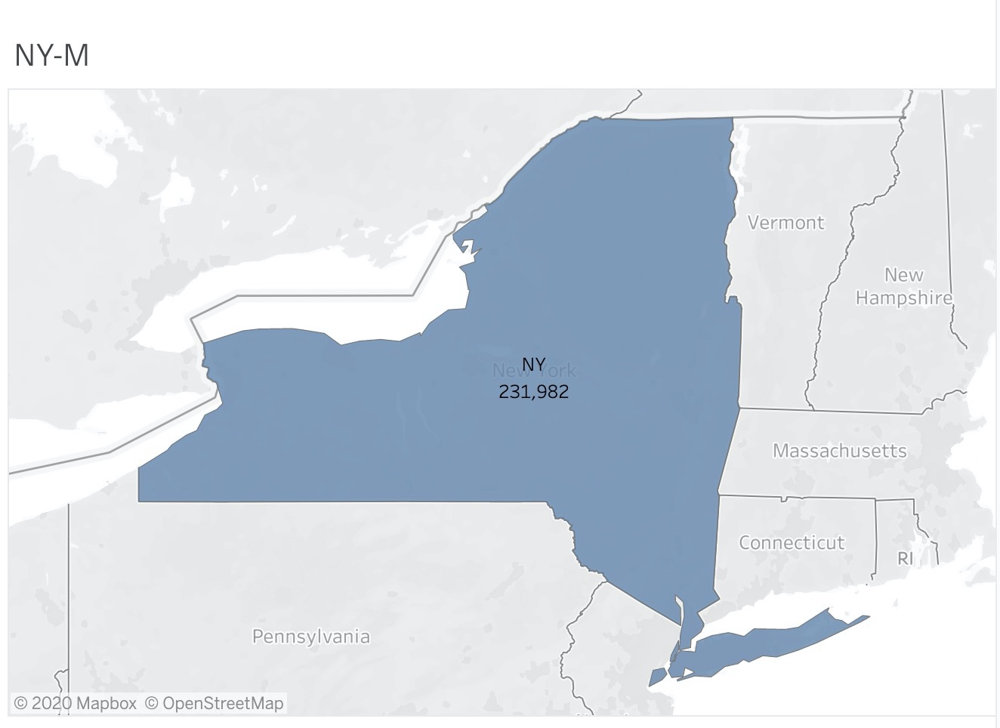
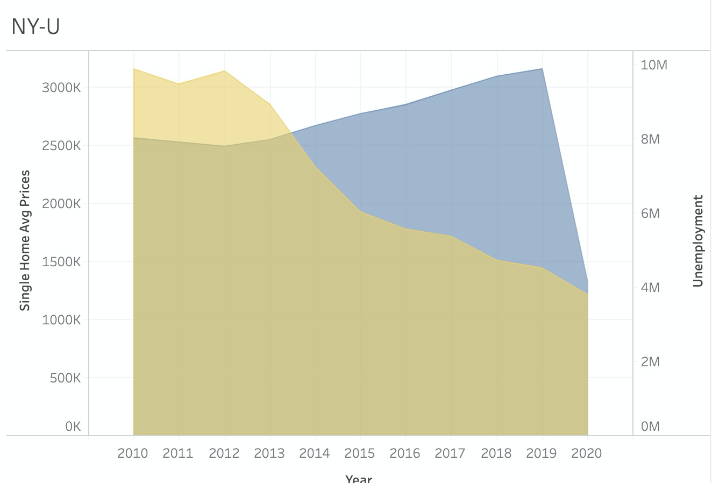
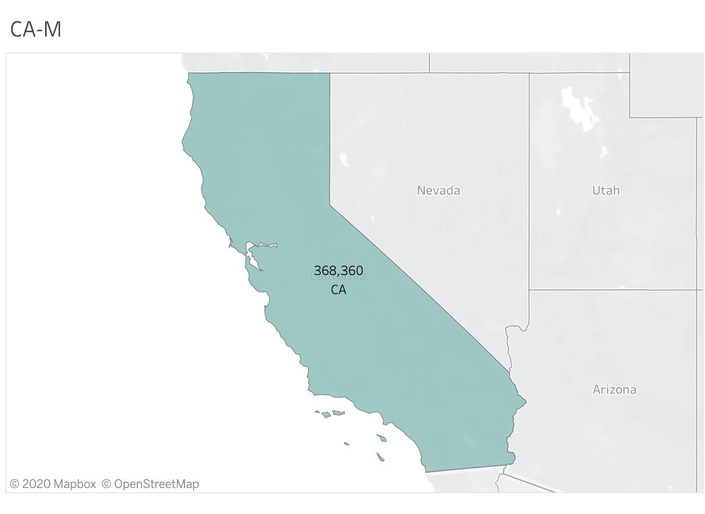
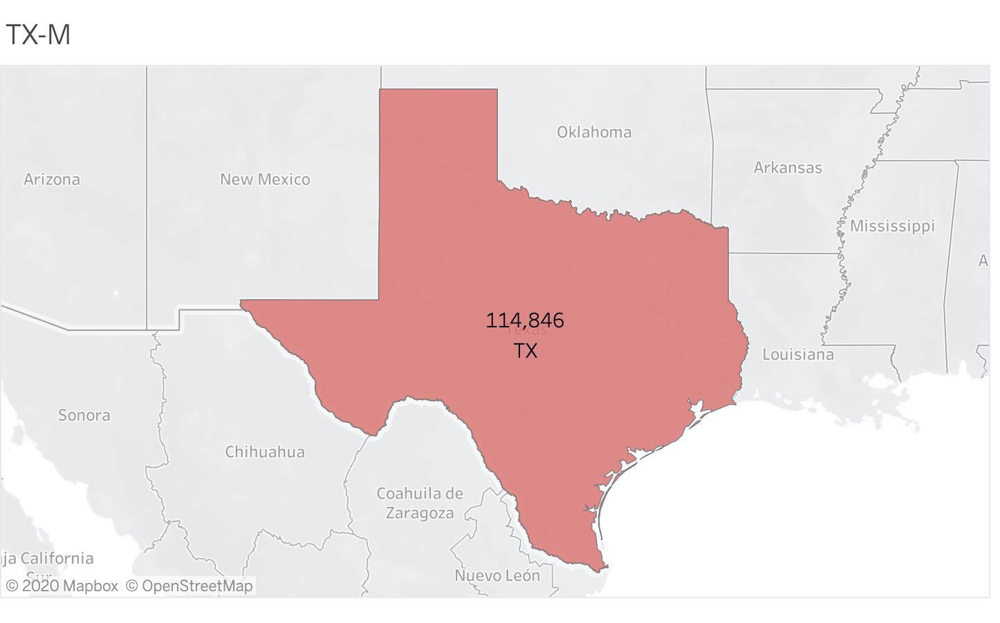
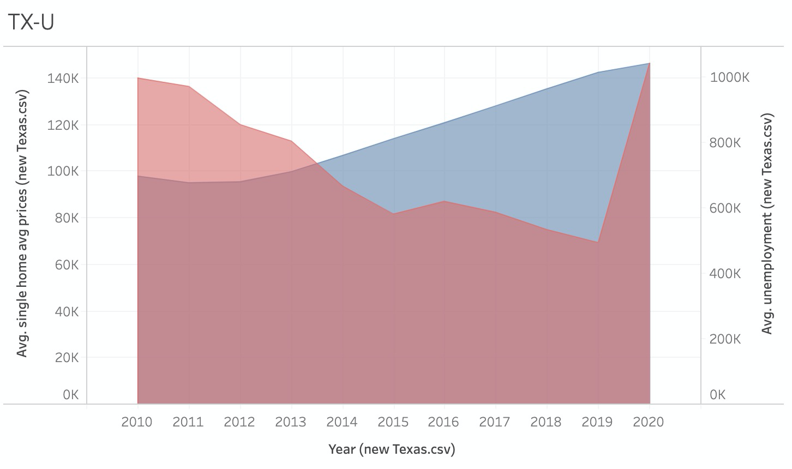
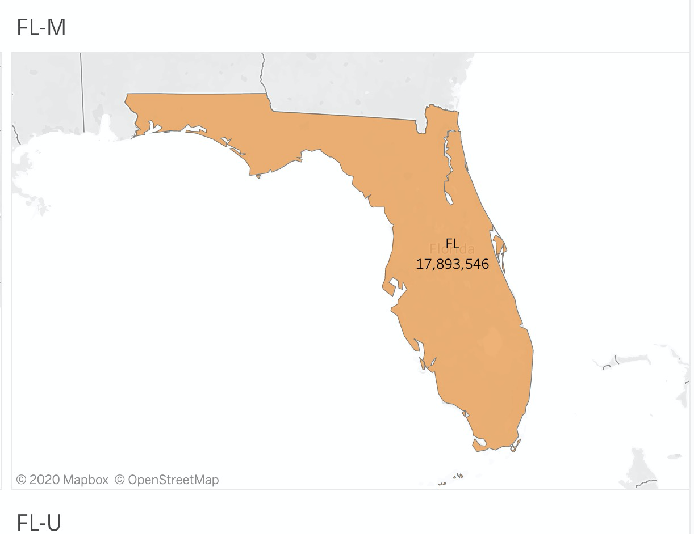
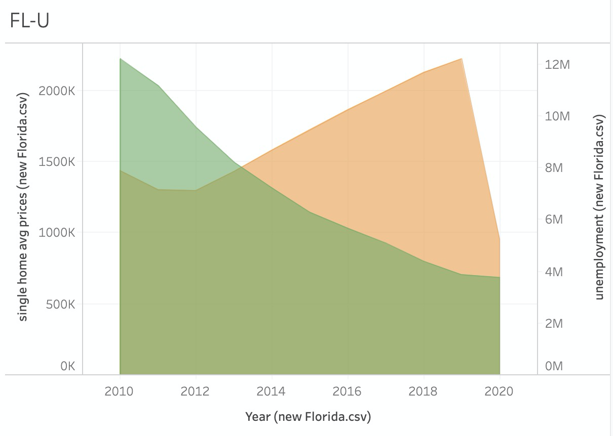

Harnessing the unemployment data from the U.S. Bureau of Labor Statistics (BLS), real estate data for single family home prices on zillow.com, the project used power of Machine Learning algorithms in order to understand the nexus between the labor and real state markets and also understand the impact of a global pandemic.

The ETL (extraction, transformation, and loading) framework that were applied in this project used multivariate linear regression algorithms.

This ML was a guided learning process that utilized 10 years of labor and real state data gathered from BLS and Zillow.com. The cleaning process included aggregating and computing more than 36 thousands rows and 250 columns in order to right size the multiple observations.

Although we had access to dataset that cover all 50 states soon we found out in our research that by applying linear regression nation wide the data was not only erratic and but also below 50% at 44.0% which render it unusable.
Facing this challenge a decision was made by the group to focus in four markets California, Florida, Texas and New York. This pivot yielded better by using the sklearn regression model for example in California we found that the ML provided 88.9% accuracy on the training score and 91.44 on the testing score. This model was reproduceble across the board yielding similar results in the range of 89% and 91% for Florida, New York, and Texas.

